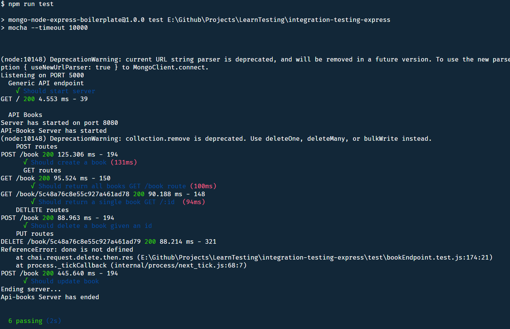

# integration-testing-express

 * Repository to learn integration testing in an express app using Mocha and Chai as testing libraries/tools
 * Also testing mocking data using faker

### Objective
 * Learn Integration testing for a REST api using Node, Express, MongoDB
   * Using testing tools such as **mocha, chai, chai-http, morgan**

 * Organize Express API better using **Controllers** resembling a more OOP way to organize communicating to DB
 * Generate Test data to be used in Mocha tests

### How to use

 * Have a `.env` file 
 * 3 env variables required
   * DATABASE_URL:string
     * URL to mongodb database to connect 
     * For this code I'm using **MongoDB**
   * PORT:number
     * Port number for server to start 
   * TEST_PORT:number
     * Port number for the test suites to run **default:8080**

* install dependencies
  *  `npm install` or `yarn`

* Run tests
  * `npm run test`

### Screenshots

### Technologies used

* Javascript
* Nodejs
* Express
* MongoDB
* Mocha
* Chai

### Tutorials Followed (Youtube)
* [Tutorial write a simple API test with Mocha in Javascript](https://www.youtube.com/watch?v=oW8uHfe8Jyk&list=WL&index=9&t=0s)
* [Test a Node RESTful API with Mocha and Chai, supplimental guide](https://www.youtube.com/watch?v=taHNdgnKCg0&list=WL&index=10&t=353s)
* [Integration Testing with Express](https://www.youtube.com/watch?v=r8sPUw4uxAI&list=WL&index=11&t=0s)

### Author

* **James Chhun** - [WingChhun](https://www.github.com/WingChhun)